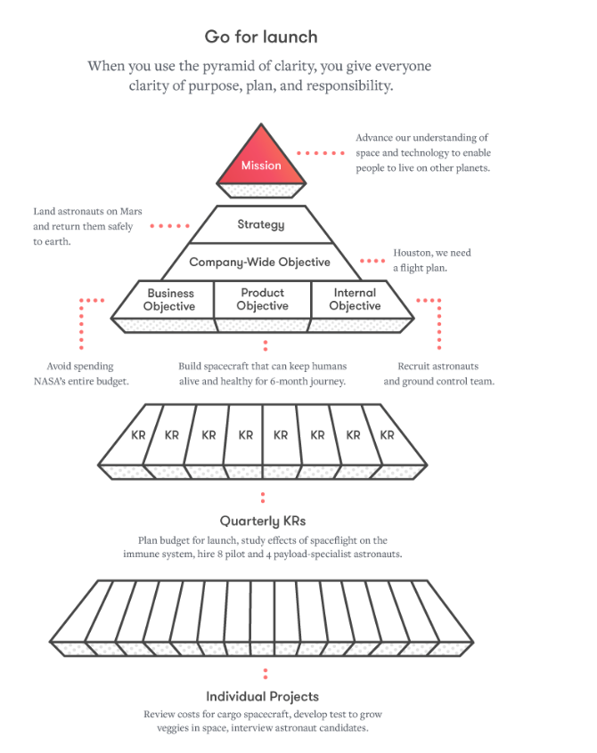

# Getting clarity

> When a team—a group of people working together toward a common goal—has clarity, everyone has a clear understanding of everything they need to know about the work required to effectively achieve their goal. What’s our goal? What’s our strategy for achieving that goal? What’s our step-by-step plan? As a member of this team, what’s my exact role to play? Which steps of the plan am I responsible for? Which decisions do I have the [authority to make?](https://wavelength.asana.com/team-empowerment-trust/) And, perhaps most importantly and most overlooked, why are we trying to achieve this goal in the first place?
>
> It would be wonderful if clarity were the default state of teams. Unfortunately, telepathy doesn’t exist yet, so instead the default state of teams is chaos and confusion. Over time—as strategies shift, plans change, and teams grow—teams tend to become even more confused.
>
> This is sad to me as a leader because—understandably—confused teams have a hard time achieving their goals. They get distracted by low priority work. [They duplicate effort](https://asana.com/why-asana). They notice too late that things fell through the cracks (since nobody knew they were responsible for that crack), so deadlines slip or quality suffers. They squabble about how to proceed (since it’s unclear who has the authority to make the decision).
>
> _**Moving teams from chaos to clarity is one of the most vital functions of leadership.**_&#x20;
>
> In an effort to cut through the chaos and confusion, teams resort to endless emails, chat threads, and status meetings. But these are symptoms of a larger issue: the lack of systematic clarity that would enable people to focus on their actual work instead of getting bogged down in the work about work of continually re-assessing what needs to get done every day.
>
> Moving teams from chaos to clarity is one of the most [vital functions of leadership](https://wavelength.asana.com/workstyle-dustin-moskovitz-leadership/). Unfortunately, leaders tend to overestimate how much clarity their team has. After all, the plan is already clear in their heads, and individual contributors tend not to surface the need for more clarity as it’s embarrassing to admit you’re not sure what you’re supposed to be doing—or why

_-_ [_Asana_](https://wavelength.asana.com/types-clarity-high-performing-teams/) _on the importance of Clarity_

> When people don’t know the order of operations, you get confusion, tension, drama. People get territorial because someone is already doing what they think they should be doing. And all you see are emails and meetings asking the same question over and over, ‘What are you working on this week?’
>
> When the details of projects, including who is responsible for what, exists outside a manager’s head, and you make all this information available to everyone, you spread out accountability. It suddenly becomes very clear when someone has dropped the ball, or if someone doesn’t have time to take on more work, or if more steps need to be taken before launch. Everyone is responsible for seeing and understanding the situation.
>
> When management is freed up, they can focus their energy on more important things: Developing their people, providing important context around projects, upgrading tools. They’re no longer spending all their time and energy simply serving as an information conduit. If your manager already knows what you’re working on and the status of your work, you can use that meeting time that would otherwise be about what you did that week to talk about how you want to develop in your role, how you want to participate in the future of the company, etc. This is how great companies grow their futures.
>
> _- Asana’s Justin Rosenstein on the_ [_One Quality Every Startup Needs to Survive_](https://firstround.com/review/Asanas-Justin-Rosenstein-on-the-One-Quality-Every-Startup-Needs-to-Survive/)

> There are six questions that everyone should be able to answer for them to have clarity:
>
> * What are you working on right now?
> * Are you confident that it’s the most important thing you could be doing?
> * Do you know who is waiting on you?
> * Do you know who you can go to for support?
> * Do you know how your work fits into the overarching product we’re trying to create?
> * Do you know why that product matters?
>
> Or to summarize, clarity is composed of clarity of purpose, clarity of the plan, and clarity of responsibility.
>
> * _-_ [_The Manager's Handbook_](https://themanagershandbook.com/creating-and-achieving-goals/clarity#the-pyramid-of-clarity)

### [The Pyramid of Clarity#](https://themanagershandbook.com/#the-pyramid-of-clarity)

> The Pyramid of Clarity shows how our longer-term aspirations are built on top of shorter-term goals, whether we’re building our product roadmap or business plans. We regularly refer back to the Pyramid of Clarity to help us stay on the same page, build confidence in our strategy and execution, and help individuals make decisions that are in line with the big picture.
>
> The Pyramid of Clarity is a simple hierarchy of mission, strategies, objectives, and key-results. We prefer it over classical OKR systems because it's simpler (less hierarchy) and still manages to incorporate a larger mission.
>
> This may seem like a lot of overhead, but you either pay the price of using this framework to consistently communicate (and how well you are performing) or you don’t, and you have to respond on the backend to people who don’t understand or get off track.

<figure><figcaption></figcaption></figure>

> * **Mission:** This is your team’s ambitious goal, your raison d’etre for the foreseeable future. Everyone on the team should know this by heart. For example, “Tesla’s mission is to accelerate the world’s transition to sustainable energy.”
> * **Strategy:** The strategy is a succinct explanation of the high-level approach you’re taking to achieve the mission. You can often boil this down to 3 bullet points. Ideally, everyone on the team is very familiar with the high-level strategy.
> * **Objectives**: These are medium-term (e.g. one year) goals. They’re ideally measurable. At Asana, for example, we create around 15 top-level objectives for the company each year. There’s a poster hanging on the wall in the office, that includes our mission, our strategy, and a list of the 15 objectives.
> * **Key results**: These are shorter-term (e.g. one-quarter) goals. Objectives are ideally measurable, but key results should for sure be measurable. It is possible to have multiple key results “leveling up” to contribute towards one objective.
> * **Projects:** These are small missions (e.g. two weeks to one year) that an individual team (e.g. 3 to 50 people) undertake in service of achieving the key result. For example this might be “Execute a nationwide marketing campaign to launch the new calendar feature.”
> * **Tasks** are the individual steps that need to be taken in order to execute the project. It may not be necessary to enumerate Every. Single. Task. right at the beginning of a project. But it’s worth writing down what is known, and what is assumed, as it forces you to get on one page and think through what is required.
